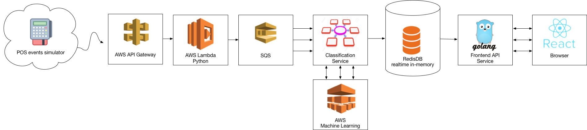
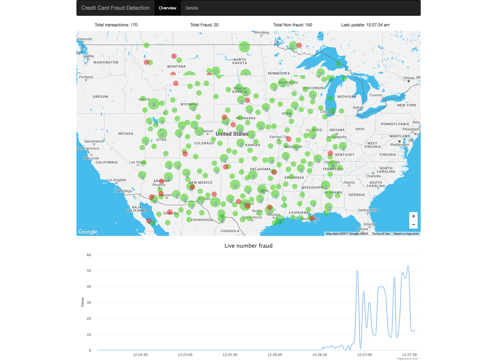

# Credit card fraud detection realtime - Front end

This is front-end source code (React) of our Credit card Fraud detection system. This is a high scalability and intelligent system, heavily rely on AWS architecture.

Our architecture




## Feature

- Use ReactJS/ Redux
- Real time update map/chart (polling)
- Map cluster (marker will be join with each other, inspired by [this](https://github.com/istarkov/google-map-clustering-example))
- Data table with pagination
- Ready to integrated with backend

## Installation

To start webpack-dev-server:
```
> npm install
> npm start
```

To start nodejs with dummy data:
```
> node server.js
```

## Demo

Please check our demo at http://creditcard-frauddetection.coddeine.com/

### Screenshot



### Video:

[Youtube](https://www.youtube.com/watch?v=sM-YQwSRZi4)

## Credits

Team member
- Serhat Artun
- Adam Lee
- Acer Jing Wei
- Vu Minh Thang
- Naresh Chebolu
